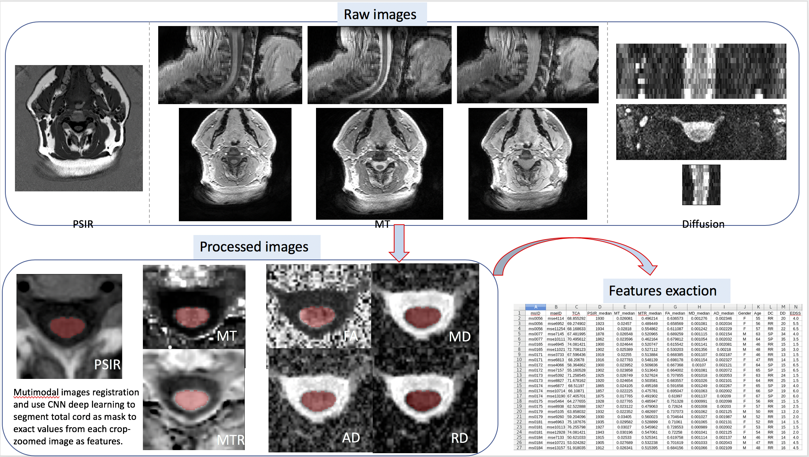

## Pipelines for Processing Brain and Spinal Cord MRI data 
#### There are two pipeline samples here 
    
    The first one is to get matric values from specific region of interests in spinal cord C2-C3 sections from 
    multimodal images as features for later on statistical analysis. It involves registraion, transformation,
    crop and upsampling images and use deep learning technique to get total cord mask then use it to get image 
    ROI values. Check out script and result: *****C23_pipeline.py, C23_output.png*****
    
    The second one is spinal cord total area measurement across medulla oblongata to C1 section. Check out 
    *****OPERA_pipeline.py, OPERA_output.png*****

<video width="320" height="240" controls>
  <source src="whole_brain_track.mp4" type="video/mp4">
</video>

#### Required Software and Tools

Suppose you already have numpy, scipy, pandas, scikit-learn, seabron pip or conda installed

FSL                https://fsl.fmrib.ox.ac.uk/fsl/fslwiki

dipy               https://nipy.org/dipy/

spinalcord toolbox https://github.com/neuropoly/spinalcordtoolbox

