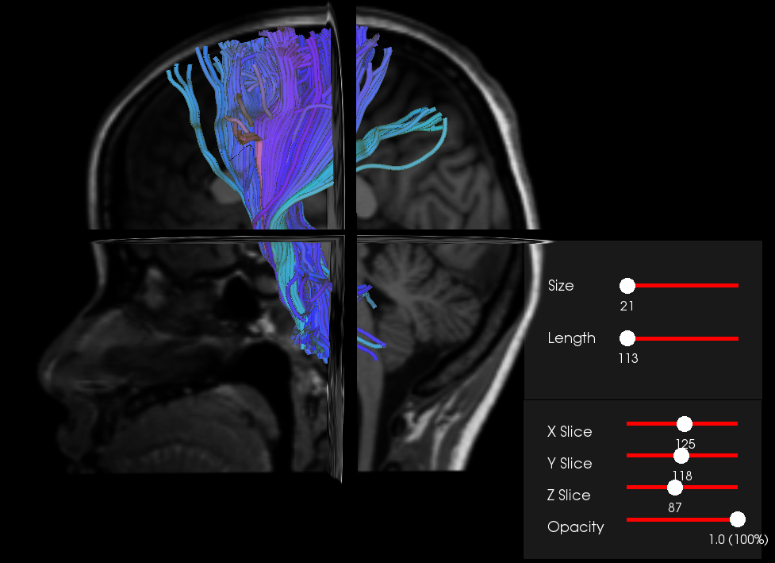

## Pipelines for Processing Brain and Spinal Cord MRI data 

### * dMRI pipeline  https://github.com/shaycheng/work_samples/blob/master/tutorial_dMRI_pipeline/dMRI_pipeline.ipynb
 

                                                                    
 
### * SpincalCord pipeline  https://github.com/shaycheng/work_samples/blob/master/tutorial_SpinalCord_pipeline/C23_pipeline.py

#### Required Software and Tools

Suppose you already have numpy, scipy, pandas, scikit-learn, seabron pip or conda installed

FSL                https://fsl.fmrib.ox.ac.uk/fsl/fslwiki

dipy               https://nipy.org/dipy/

spinalcord toolbox https://github.com/neuropoly/spinalcordtoolbox

